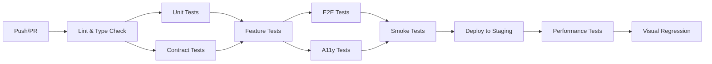

# Frontend Testing Implementation Plan

> **Created:** 2026-02-17
> **Purpose:** Complete testing implementation based on strategy documents
> **Status:** In Progress

## Executive Summary

This plan outlines what testing infrastructure has been implemented versus what's documented in our testing strategy, and provides a prioritized roadmap to complete the test suite.

---

## Current State Assessment

### ✅ Implemented

#### Test Infrastructure
- [x] Vitest configuration (`vitest.config.mts`)
- [x] Playwright configuration (`playwright.config.ts`)
- [x] Test setup utilities (`test/setup/`)
  - [x] API mocks (`api-mocks.ts`)
  - [x] Render utilities (`render-utils.tsx`)
  - [x] Index setup file (`index.ts`)
- [x] Package.json test scripts
- [x] Coverage thresholds configured (80% target)

#### Unit Tests
- [x] **packages/ui** - 2 component tests
  - [x] Button component (`button.test.tsx`)
  - [x] Input component (`input.test.tsx`)
- [x] **packages/auth** - Auth tests (`auth.test.ts`)
- [x] **packages/api-client** - Client tests (`client.test.ts`)

#### Feature Tests (Portal)
- [x] **apps/portal/__tests__/**
  - [x] Catalog feature (`catalog/catalog.test.tsx`)
  - [x] Cart feature (`cart/cart.test.tsx`)
  - [x] Orders feature (`orders/orders.test.tsx`)

#### Feature Tests (Admin)
- [x] **apps/admin/__tests__/**
  - [x] Users management (`users/users-admin.test.tsx`)
  - [x] Orders management (`orders/orders-admin.test.tsx`)

#### E2E Tests
- [x] **Portal E2E** (`e2e/portal/`)
  - [x] Authentication flow (`auth.e2e.spec.ts`)
  - [x] Shopping flow (`shopping-flow.e2e.spec.ts`)
  - [x] Quotes flow (`quotes.e2e.spec.ts`)
- [x] **Admin E2E** (`e2e/admin/`)
  - [x] Authentication flow (`auth.e2e.spec.ts`)
  - [x] Order management (`order-management.e2e.spec.ts`)

#### Accessibility Tests
- [x] **Portal A11y** (`e2e/a11y/portal/portal.a11y.spec.ts`)
- [x] **Admin A11y** (`e2e/a11y/admin/admin.a11y.spec.ts`)

---

### ❌ Missing (High Priority)

#### P0 - Critical Path Tests
According to TEST-COVERAGE-MATRIX.md, these are marked as ✅ but need verification:

| Feature | Status in Matrix | Actual Status | Gap |
|---------|-----------------|---------------|-----|
| **Checkout Flow** | ✅ E2E | Partial | Missing comprehensive checkout tests |
| **Order Tracking** | ✅ Feature + E2E | Partial | Basic tests exist, need edge cases |
| **Quote Management** | ⬜ Unit + Feature | E2E only | Missing unit and feature tests |
| **Contract Viewing** | ⬜ All | Missing | No tests exist |
| **Approvals Inbox** | ⬜ All | Missing | New feature (FE-018) - no tests |

#### P0 - Contract Testing (NEW REQUIREMENT)
From TESTING-STRATEGY.md "Lessons Learned" section:
- [ ] API contract validation tests
- [ ] OpenAPI schema validation
- [ ] Frontend DTO vs Backend schema tests
- [ ] Type safety verification

#### P0 - Component Library Tests
From TEST-COVERAGE-MATRIX.md Component Coverage Matrix:
- [ ] Select component
- [ ] Modal component
- [ ] Table component
- [ ] Card component
- [ ] Badge component
- [ ] Toast component
- [ ] Pagination component
- [ ] Loading component
- [ ] DatePicker component
- [ ] Checkbox component
- [ ] Switch component

#### P1 - Missing Feature Tests
Portal features with no unit/feature tests:
- [ ] Quote Builder (has E2E only)
- [ ] Contract Detail View
- [ ] Approval Detail View
- [ ] Notification Center
- [ ] Payment History
- [ ] Salary Deduction
- [ ] Partner Dashboard
- [ ] Discount Tiers

Admin features with no tests:
- [ ] Catalog Management
- [ ] Tenant Management
- [ ] Organization Management
- [ ] Audit Logs
- [ ] Dashboard/KPIs
- [ ] Reports

#### P1 - Edge Cases & Error Handling
From TEST-COVERAGE-MATRIX.md Edge Cases section - ALL marked as ⬜:
- [ ] Authentication edge cases (invalid credentials, expired token, network errors, session timeout)
- [ ] Cart edge cases (empty cart, out of stock, price changes, max quantity)
- [ ] Form validation edge cases (empty fields, invalid formats, server errors)

#### P2 - Infrastructure Gaps
- [ ] Smoke tests for critical paths (post-deploy)
- [ ] Performance tests (Lighthouse CI)
- [ ] Visual regression tests (Storybook)
- [ ] Test data fixtures (JSON files)
- [ ] Automated dependency setup scripts
- [ ] CI/CD pipeline integration

---

## Implementation Roadmap

### Phase 1: Fix Critical Gaps (Week 1-2)

**Goal:** Ensure P0 features have complete test coverage

#### Week 1: Contract Testing & API Validation
```bash
Priority: P0
Estimated Effort: 3-4 days
```

**Tasks:**
1. **Create contract test infrastructure**
   ```
   test/contract/
   ├── schemas/
   │   └── openapi-schemas.test.ts
   ├── dto-validation/
   │   ├── order-dto.contract.spec.ts
   │   ├── quote-dto.contract.spec.ts
   │   └── approval-dto.contract.spec.ts
   └── type-safety.spec.ts
   ```

2. **Implement OpenAPI schema validation**
   - Compare frontend DTOs against backend OpenAPI schema
   - Validate all API request/response types
   - Add to CI pipeline

3. **Add API client generation checks**
   - Ensure generated types match backend spec
   - Add pre-commit hook for type checking

**Deliverables:**
- [ ] Contract test suite passing
- [ ] All API endpoints validated
- [ ] Type safety checks in CI

#### Week 2: Approvals & Quotes Unit Tests
```bash
Priority: P0
Estimated Effort: 3-4 days
```

**Tasks:**
1. **Approvals Inbox Tests** (FE-018 - just implemented)
   ```
   apps/portal/src/__tests__/approvals/
   ├── approvals-list.test.tsx
   ├── approval-detail.test.tsx
   ├── approval-actions.test.tsx
   └── approval-timeline.test.tsx
   ```

2. **Quote Builder Tests**
   ```
   apps/portal/src/__tests__/quotes/
   ├── quote-builder.test.tsx
   ├── quote-details-step.test.tsx
   ├── quote-products-step.test.tsx
   └── quote-review-step.test.tsx
   ```

3. **Contract Tests**
   ```
   apps/portal/src/__tests__/contracts/
   ├── contract-list.test.tsx
   ├── contract-detail.test.tsx
   └── contract-workflow.test.tsx
   ```

**Deliverables:**
- [ ] Approvals: 100% coverage
- [ ] Quotes: 100% coverage
- [ ] Contracts: 100% coverage

### Phase 2: Component Library Coverage (Week 3)

**Goal:** Complete @b2b/ui component tests

```bash
Priority: P0
Estimated Effort: 4-5 days
```

**Tasks:**
1. **Core Interactive Components**
   ```
   packages/ui/src/components/
   ├── select.test.tsx
   ├── modal.test.tsx
   ├── table.test.tsx
   ├── toast.test.tsx
   ├── pagination.test.tsx
   ├── date-picker.test.tsx
   ├── checkbox.test.tsx
   └── switch.test.tsx
   ```

2. **Test Requirements per Component**
   - Rendering (all variants/states)
   - User interactions (clicks, keyboard navigation)
   - Accessibility (ARIA attributes, keyboard support)
   - Edge cases (disabled states, loading, errors)

3. **Visual Tests (Storybook)**
   ```
   packages/ui/src/components/
   ├── button.stories.tsx
   ├── input.stories.tsx
   ├── select.stories.tsx
   └── ... (one per component)
   ```

**Deliverables:**
- [ ] 100% component unit test coverage
- [ ] Storybook stories for all components
- [ ] Visual regression baseline

### Phase 3: Edge Cases & Error Handling (Week 4)

**Goal:** Test all documented edge cases

```bash
Priority: P1
Estimated Effort: 3-4 days
```

**Tasks:**
1. **Authentication Edge Cases**
   ```
   apps/portal/src/__tests__/auth/
   ├── invalid-credentials.test.tsx
   ├── expired-token.test.tsx
   ├── network-errors.test.tsx
   └── session-timeout.test.tsx
   ```

2. **Cart Edge Cases**
   ```
   apps/portal/src/__tests__/cart/
   ├── empty-cart.test.tsx
   ├── out-of-stock.test.tsx
   ├── price-changes.test.tsx
   └── max-quantity.test.tsx
   ```

3. **Form Validation Edge Cases**
   ```
   apps/portal/src/__tests__/forms/
   ├── empty-fields.test.tsx
   ├── invalid-formats.test.tsx
   └── server-validation.test.tsx
   ```

**Deliverables:**
- [ ] All edge cases from TEST-COVERAGE-MATRIX.md tested
- [ ] Error boundary tests
- [ ] Loading state tests

### Phase 4: Admin Portal Coverage (Week 5)

**Goal:** Complete admin feature tests

```bash
Priority: P1
Estimated Effort: 4-5 days
```

**Tasks:**
1. **Catalog Management**
   ```
   apps/admin/src/__tests__/catalog/
   ├── product-list.test.tsx
   ├── product-create.test.tsx
   ├── product-edit.test.tsx
   └── category-management.test.tsx
   ```

2. **Tenant & Organization Management**
   ```
   apps/admin/src/__tests__/tenants/
   ├── tenant-list.test.tsx
   ├── tenant-create.test.tsx
   └── org-hierarchy.test.tsx
   ```

3. **Audit & Reports**
   ```
   apps/admin/src/__tests__/
   ├── audit/audit-logs.test.tsx
   ├── dashboard/kpis.test.tsx
   └── reports/export.test.tsx
   ```

**Deliverables:**
- [ ] Admin feature parity with Portal
- [ ] Role-based access tests
- [ ] Bulk operations tests

### Phase 5: Infrastructure & Automation (Week 6)

**Goal:** Automated test infrastructure

```bash
Priority: P1-P2
Estimated Effort: 3-4 days
```

**Tasks:**
1. **Smoke Tests**
   ```
   test/smoke/
   ├── critical-paths.smoke.spec.ts
   └── post-deploy.smoke.spec.ts
   ```

2. **Test Data Fixtures**
   ```
   test/fixtures/
   ├── tenants/default-tenant.json
   ├── users/test-users.json
   ├── products/catalog-100.json
   └── orders/sample-orders.json
   ```

3. **Setup Automation**
   ```
   test/setup/
   ├── tenant.setup.ts
   ├── catalog.setup.ts
   ├── cart.setup.ts
   └── resolver.ts (dependency resolution)
   ```

4. **CI/CD Integration**
   ```
   .github/workflows/
   ├── test-unit.yml
   ├── test-e2e.yml
   ├── test-a11y.yml
   └── test-contract.yml
   ```

**Deliverables:**
- [ ] Smoke tests running post-deploy
- [ ] Fixtures for all features
- [ ] Automated dependency setup
- [ ] CI/CD pipelines configured

### Phase 6: Performance & Visual (Week 7)

**Goal:** Non-functional testing

```bash
Priority: P2
Estimated Effort: 3-4 days
```

**Tasks:**
1. **Performance Tests**
   ```
   test/perf/
   ├── catalog-load.perf.spec.ts
   ├── cart-operations.perf.spec.ts
   └── checkout-flow.perf.spec.ts
   ```

2. **Lighthouse CI**
   - Configure Lighthouse CI
   - Set Core Web Vitals thresholds
   - Add to CI pipeline

3. **Visual Regression**
   - Storybook visual testing
   - Percy or Chromatic integration
   - Baseline snapshots

**Deliverables:**
- [ ] Performance benchmarks
- [ ] Lighthouse CI passing
- [ ] Visual regression suite

---

## Test Execution Plan

### Local Development

```bash
# Run all unit tests
pnpm test

# Run with coverage
pnpm test:coverage

# Run specific feature
pnpm test --testPathPattern="approvals"

# Watch mode
pnpm test --watch

# E2E tests
pnpm test:e2e

# A11y tests
pnpm test:a11y

# Full suite
pnpm test:all
```

### CI/CD Pipeline



### Coverage Requirements

| Test Type | Current | Target | Status |
|-----------|---------|--------|--------|
| Unit | ~30% | 80% | 🔴 Gap |
| Feature | ~20% | 80% | 🔴 Gap |
| E2E | ~40% | 100% P0 | 🟡 Partial |
| A11y | ~10% | 100% | 🔴 Gap |
| Contract | 0% | 100% | 🔴 Missing |

---

## Success Metrics

### Phase 1 Complete
- [ ] Contract tests covering all API endpoints
- [ ] Approvals, Quotes, Contracts: 100% unit + feature coverage
- [ ] No API DTO mismatches detected

### Phase 2 Complete
- [ ] All @b2b/ui components: 100% test coverage
- [ ] Storybook stories for visual testing
- [ ] Zero accessibility violations in component tests

### Phase 3 Complete
- [ ] All edge cases from coverage matrix tested
- [ ] Error handling coverage: 100%
- [ ] Loading/skeleton state tests: 100%

### Phase 4 Complete
- [ ] Admin portal feature parity with Portal
- [ ] Role-based access control tests: 100%
- [ ] Audit log coverage: 100%

### Phase 5 Complete
- [ ] Smoke tests in CI/CD
- [ ] Test data fixtures for all features
- [ ] Automated dependency setup
- [ ] CI/CD pipeline green

### Phase 6 Complete
- [ ] Performance tests passing
- [ ] Lighthouse score ≥ 90
- [ ] Visual regression baseline established

---

## Risk Mitigation

### High-Risk Areas

1. **Contract Testing Complexity**
   - Risk: OpenAPI schema validation may be complex
   - Mitigation: Start with simple DTOs, iterate
   - Timeline buffer: +2 days

2. **E2E Test Flakiness**
   - Risk: Playwright tests may be flaky
   - Mitigation: Implement retry logic, stable selectors
   - Action: Add test-id attributes to components

3. **Coverage Gaps**
   - Risk: May not reach 80% coverage target
   - Mitigation: Focus on critical paths first
   - Fallback: Document untested areas with tickets

### Dependencies

- Backend OpenAPI spec must be up-to-date
- Test environment must be stable
- Test data must be consistent

---

## Team Allocation

### Recommended Allocation
- **Week 1-2:** 2 developers (Contract + Feature tests)
- **Week 3-4:** 1 developer (Components + Edge cases)
- **Week 5-6:** 1 developer (Admin + Infrastructure)
- **Week 7:** 1 developer (Performance + Visual)

### Total Effort
- **7 weeks** (can be parallelized)
- **~4-5 developer-weeks** of actual work

---

## Quick Start Actions

To start immediately:

1. **Create missing test files**
   ```bash
   # Approvals tests
   mkdir -p apps/portal/src/__tests__/approvals
   touch apps/portal/src/__tests__/approvals/approvals-list.test.tsx
   touch apps/portal/src/__tests__/approvals/approval-detail.test.tsx

   # Component tests
   touch packages/ui/src/components/select.test.tsx
   touch packages/ui/src/components/modal.test.tsx

   # Contract tests
   mkdir -p test/contract
   touch test/contract/order-api.contract.spec.ts
   ```

2. **Run existing tests**
   ```bash
   pnpm test:coverage
   pnpm test:e2e
   pnpm test:a11y
   ```

3. **Review failing/skipped tests**
   - Fix any broken tests
   - Unskip skipped tests
   - Update snapshots

4. **Set up CI/CD**
   - Create `.github/workflows/test.yml`
   - Add coverage reporting
   - Set up status checks

---

## Tracking Progress

### Use TEST-COVERAGE-MATRIX.md
- Update checkboxes as tests are implemented
- Change ⬜ to ✅ when complete
- Add notes for partial coverage

### Use This Plan
- Mark phases complete as delivered
- Update metrics weekly
- Track blockers and risks

### Weekly Standup
- Review coverage metrics
- Discuss blockers
- Prioritize next tests

---

## References

- [TESTING-STRATEGY.md](./TESTING-STRATEGY.md) - Overall strategy
- [TEST-COVERAGE-MATRIX.md](./TEST-COVERAGE-MATRIX.md) - Detailed coverage tracking
- [TEST-DEPENDENCIES.md](./TEST-DEPENDENCIES.md) - Test prerequisites
- [vitest.config.mts](../../vitest.config.mts) - Unit test config
- [playwright.config.ts](../../playwright.config.ts) - E2E test config

---

## Appendix: File Organization

```
b2b-web/
├── test/
│   ├── setup/              ✅ Exists
│   ├── contract/           ❌ Create
│   ├── smoke/              ❌ Create
│   └── fixtures/           ❌ Create
├── e2e/
│   ├── portal/             ✅ Partial (3 tests)
│   ├── admin/              ✅ Partial (2 tests)
│   └── a11y/               ✅ Partial (2 tests)
├── apps/
│   ├── portal/src/__tests__/
│   │   ├── catalog/        ✅ Exists
│   │   ├── cart/           ✅ Exists
│   │   ├── orders/         ✅ Exists
│   │   ├── quotes/         ⬜ Empty folder
│   │   ├── approvals/      ❌ Create
│   │   ├── contracts/      ❌ Create
│   │   └── auth/           ❌ Create
│   └── admin/src/__tests__/
│       ├── users/          ✅ Exists
│       ├── orders/         ✅ Exists
│       ├── catalog/        ❌ Create
│       ├── tenants/        ❌ Create
│       └── audit/          ❌ Create
└── packages/
    └── ui/src/components/
        ├── button.test.tsx     ✅ Exists
        ├── input.test.tsx      ✅ Exists
        ├── select.test.tsx     ❌ Create
        ├── modal.test.tsx      ❌ Create
        └── ... (9 more)        ❌ Create
```

---

**Next Step:** Begin Phase 1, Week 1 - Contract Testing Infrastructure
